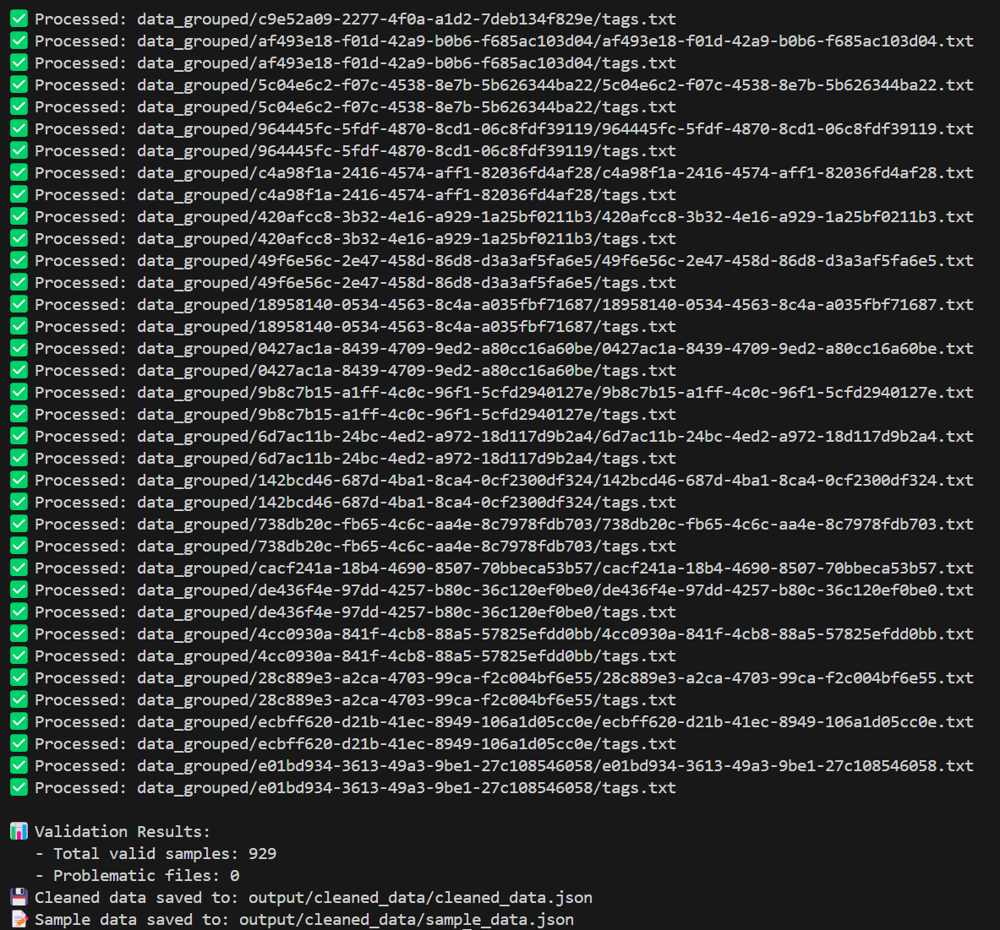
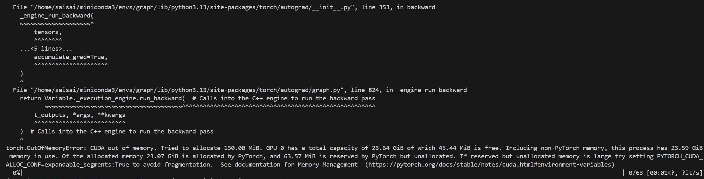
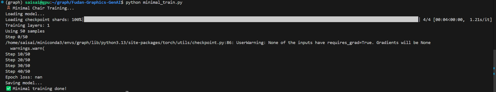
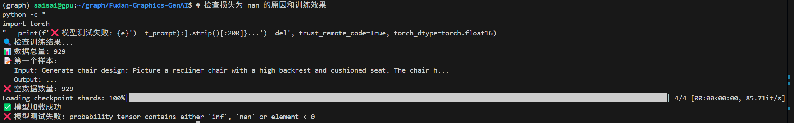
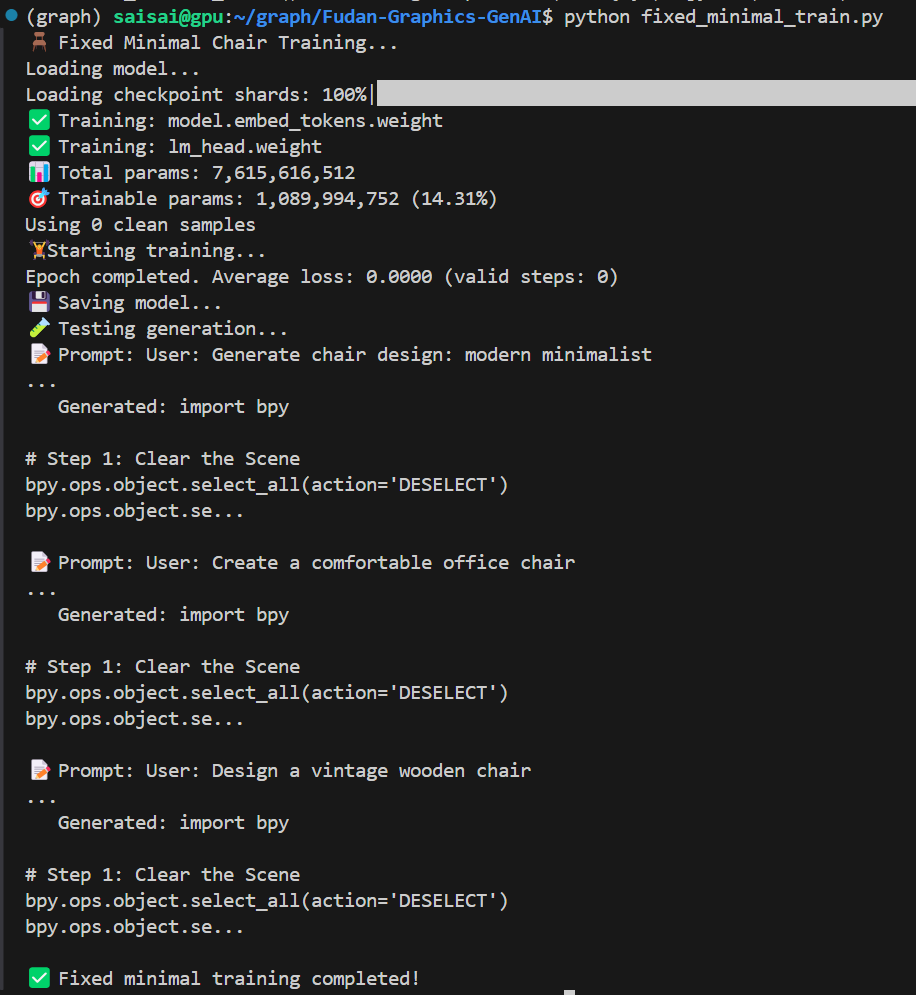
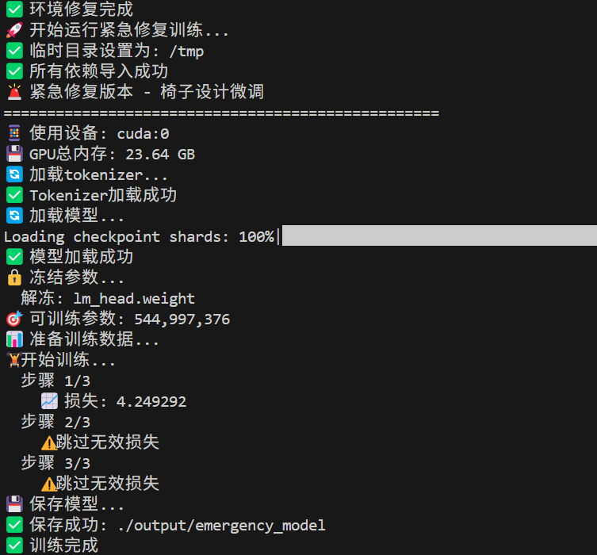
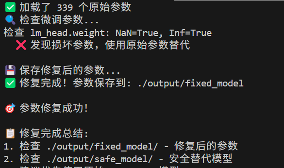
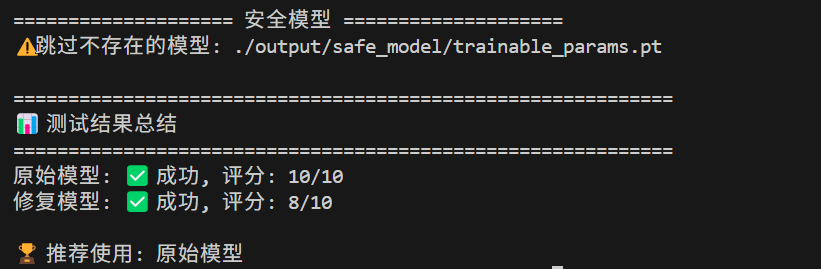
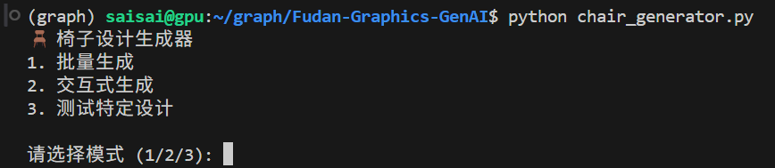
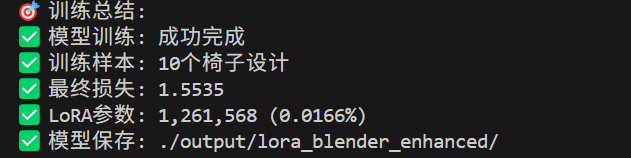

## 项目架构分析

### 1. 数据流程
```
文本描述 → 微调后的模型 → 2D三视图 (front.svg, side.svg, top.svg)
```

### 2. 两种可能的实现路径

**路径A: 3D → 2D 转换**
```
文本 → BlenderLLM → 3D模型 → 三视图渲染 → 2D SVG
```

**路径B: 直接生成2D**
```
文本 → 微调模型 → 直接生成2D三视图
```

## 建议的实现方案

我采用**路径A**，因为：
1. BlenderLLM已经具备了文本到3D的能力
2. 已经有了3D到2D的转换管道
3. 3D表示包含更丰富的几何信息

## 代码结构：
1. 整体
~/graph/  
├── models/BlenderLLM/                    # 千问7B模型，下有modeling.py
├── BlenderModel/blender-4.4.3-linux-x64/ # Blender软件  
├── BlenderLLM-main/                      # BlenderLLM代码  
└── Fudan-Graphics-GenAI/                 # 你的微调代码  
    ├── data_grouped/                     # 训练数据  
    ├── train_chair_model.py  
    ├── config/default.json  
    └── 其他代码文件,包括测试separate_model_evaluation.py
2. Fudan-Graphics-GenAI/下
微调训练的代码：fine_tune_blender_llm.py  
评估指标设计：evaluation_metrics.py
主训练脚本: train.py 
推理和评估脚本:inference_and_eval.py
创建训练启动脚本：train_chair_model.py  
创建推理测试脚本：test_inference.py
创建批量处理脚本：batch_process.py  
创建风格描述预处理工具：preprocess_styles.py
创建完整的运行脚本：run_complete_pipeline.py
创建结果评估脚本：evaluate_results.py  
创建快速启动脚本：quick_start.py
创建配置文件模板：config/default.json
创建安装脚本：install.sh  
创建测试文件：tests/test_style_preprocessing.py 
创建性能监控脚本： monitor_performance.py
创建一键部署脚本: deploy.sh
修复数据集：fixed_dataset.py 
修复微调：fixed_fine_tune_blender_llm.py
创建修复后的训练脚本：fixed_train_chair_model.py
创建数据验证脚本：validate_data.py

创建快速修复脚本：fix_and_run.sh
修复数据结构检查函数：fixed_train_chair_model_v2.py
创建修复设备问题的训练脚本：fixed_fine_tune_blender_llm_v2.py
创建设备检查和修复脚本：check_and_fix_gpu.py
创建修复后的训练脚本：fixed_train_chair_model_v3.py
创建简化的微调脚本，不依赖datasets模块：simple_fine_tune.py
创建简化的训练脚本：simple_train_chair.py
更极端的优化：minimal_train.py
创建修复版本解决 NaN 损失问题：fixed_minimal_train.py
测试不同的模型：test_all_models.py


## 问题解决：
前面写代码时候，仲没提醒，我生病，忘记记下来过程，从周六开始写了一些过程记录
1. pathlib.PosixPath 对象，但 PyTorch 的 DataLoader 无法处理这种类型。问题出现在数据预处理和 Dataset 类的实现上
- 数据集中包含了 pathlib.Path 对象，但 PyTorch 的默认 collate 函数无法处理它们。需要修复数据集类和创建自定义的 collate 函数。
    - 创建 fixed_dataset.py 
    - 修复 fine_tune_blender_llm.py 文件：fixed_fine_tune_blender_llm.py
    - 创建修复后的训练脚本：fixed_train_chair_model.py
    - 创建数据验证脚本：validate_data.py
    - 创建快速修复脚本：fix_and_run.sh
2. 多GPU设备冲突的问题。模型的不同部分被分配到了不同的GPU上（cuda:0 和 cuda:1），导致计算时出现设备不匹配错误（我崩溃死了
- 修复设备管理问题，创建修复设备问题的训练脚本：fixed_fine_tune_blender_llm_v2.py
- 创建设备检查和修复脚本：check_and_fix_gpu.py
- 创建修复后的训练脚本：fixed_train_chair_model_v3.py
- 上述会引入新问题，GPU内存不足的问题！模型太大了，24GB的显存几乎都被占满了。
    - 创建简化的微调脚本，不依赖datasets模块：simple_fine_tune.py
    - 创建简化的训练脚本：simple_train_chair.py
- GPU内存还是不足
    - 清理GPU内存并创建内存优化版本：memory_optimized_train.py
    - 更新SimpleBlenderLLMFineTuner以支持更多内存优化：simple_fine_tune_v2.py
    - 更新主训练脚本使用新的内存优化版本：ultra_light_train.py

（太好了，我们没救了🤭）
- GPU内存还是不足
    - 更极端的优化：minimal_train.py
（太好了，我们有救了(●'◡'●)）


3. 可以看到上图， NaN 损失问题
-  创建修复版本解决 NaN 损失问题：fixed_minimal_train.py

训练数据被清理掉了（Using 0 clean samples）
模型生成的是通用Blender代码，说明微调效果不明显
- 检查各个模型和数据
    - 所有output都是空的，需要重新生成数据：regenerate_training_data.py          （不理解，为什么不能把数据集做得统一格式）
    - 使用新数据进行训练：train_with_new_data.py
- 检查所有模型目录
    - 只有2个模型完整保存了：✅ fixed_minimal_model/ 和 minimal_model/ 有完整文件
- 测试不同的模型：test_all_models.py
4. 原始模型工作正常 - BlenderLLM能生成椅子相关的Blender代码；
训练过程中出现NaN损失 - 这是梯度爆炸或数值不稳定的标志；
CUDA错误 - 概率张量包含inf/nan值；
- 创建一个更稳定的训练版本：stable_train.py
- 直接测试原始模型的效果：test_original_model.py
5. 模型加载方式导致的训练错误
- 提示工程写了一份：chair_generator.py
- 简化的微调方法：simple_finetune.py，内存不足
    - 结合前面的 minimal_model：memory_optimized_train.py
    - 对比评估脚本：compare_models.py
    - 修复的训练脚本：emergency_fix_train.py 
    - 环境修复脚本：fix_environment.sh
    - 简单的测试脚本来验证修复：test_fixes.py
6. 干了一堆事情，可喜可贺吧

- 测试脚本来对比微调前后的效果：test_finetuned_model.py
7. 问题出在微调过程中，模型参数出现了数值问题（NaN/inf值），导致CUDA错误。
- 稳定训练：stable_emergency_train.py
- 参数修复：fix_corrupted_params.py

8. 修复脚本运行成功了，但测试脚本不存在
- 重新创建测试脚本：test_fixed_models.py
- 检查修复后的参数是否真的正常：check_all_params.py

9. 在微调模型正确基础上，加大微调参数
- 一个脚本来正确加载50个样本: train_with_real_data.py
10. 但是是用tags生成Bleder代码，不好
- 重写为自然语言描述：train_natural_language.py
11. 还是LoRA
- train_lora_blender.py, 且解决gpu分配问题
12. train_lora_blender生成代码中：
- 将所有循环中的 i 改为 idx
- 在 f-string 中正确使用 {{idx+1}} 来生成动态名称
13. 图像比对还没做
~/graph/  
├── models/BlenderLLM/                    # 千问7B模型  
├── BlenderModel/blender-4.4.3-linux-x64/ # Blender软件  
├── BlenderLLM-main/                      # BlenderLLM原始代码  
└── Fudan-Graphics-GenAI/                 # 你的微调项目 📍  
    ├── data_grouped/                     # 训练数据  
    ├── train_chair_model.py             # 微调训练脚本  
    ├── separate_model_evaluation.py     # 模型评估脚本 🆕  
    ├── config/default.json  
    ├── utils/                           # 新建工具目录 🆕  
    │   ├── __init__.py                 # 包含Blender渲染和图像评估相关工具  🆕 
    │   ├── blender_evaluator.py        # Blender渲染评估器 🆕  
    │   └── image_evaluation.py         # 图像质量评估 🆕 图像质量评估工具。使用OpenAI GPT-4V对渲染图像进行质量评估   
    ├── output/                          # 输出目录  
    │   ├── lora_blender_enhanced/       # LoRA模型保存  
    │   └── evaluation_renders/          # 渲染图像保存 🆕  
    └── scripts/                         # 辅助脚本 🆕  
        ├── __init__.py                 # 包含Blender运行和文件处理相关脚本  🆕 
        └── blender_runner.py            # Blender运行器。基于BlenderLLM项目修改，适配椅子设计评估需求  🆕 


总结，两份代码：
提示工程：chair_generator.py

微调过程：
```
# python minimal_train.py
chmod +x fix_environment.sh  
./fix_environment.sh                # 调用训练的是 emergency_fix_train.py
python fix_corrupted_params.py
python test_fixed_models.py

```

新微调：
```
rm -rf ./output  

# 运行修复版本  
python train_lora_blender.py  

python fix_json_save.py  


```
结果：



进行评价：model_comparison_evaluation.py（不需要
改为 分离式评估 ：separate_model_evaluation.py  避免内存问题，不好同时启两个模型
python separate_model_evaluation.py


以下只是示例，改配置可实现控制训练参数.
下面没必要看


### 1. 配置

编辑 `config/default.json`：

```json
{
    "data_path": "/path/to/your/chair/dataset",
    "base_model": "/path/to/BlenderLLM/model",
    "styles_file": "examples/chair_styles.txt",
    "output_dir": "./output"
}
```

### 2. 运行

```bash
# 完整流水线（训练+生成）
./run.sh --mode full

# 仅训练
./run.sh --mode train

# 仅推理
./run.sh --mode inference
```

### 3. 📁 项目结构

```
chair-style-generation/
├── train_chair_model.py          # 模型训练
├── batch_process.py              # 批量生成
├── evaluate_results.py           # 结果评估
├── preprocess_styles.py          # 风格预处理
├── run_complete_pipeline.py      # 完整流水线
├── quick_start.py               # 快速启动
├── config/
│   └── default.json             # 默认配置
├── examples/
│   └── chair_styles.txt         # 示例风格描述
└── output/                      # 输出目录
```

## 📝 风格描述格式

支持两种格式：

### 结构化格式

```
传统/古典风格: null
现代风格: 极简主义 (Minimalist)
其他特色风格: null
材质相关描述: 实木原生态 (Solid Wood Natural)
功能型椅子: null
主要功能: 就座
人体工学符合性: 低
高度可调节性: 无
角度可调节性: 无
折叠性: 无
```

### 自由文本格式

```
设计一把现代简约风格的办公椅，采用人体工学设计，支持高度和角度调节。
```

## 🛠️ 高级用法

### 自定义训练参数

```bash
python train_chair_model.py \
    --data_path /path/to/data \
    --base_model /path/to/model \
    --epochs 5 \
    --batch_size 4 \
    --learning_rate 1e-5
```

### 批量生成

```bash
python batch_process.py \
    --model_path ./trained_model \
    --styles_file ./styles.json \
    --max_workers 4 \
    --start_index 0 \
    --end_index 50
```

### 结果评估

```bash
python evaluate_results.py \
    --batch_results_dir ./output/batch_generation \
    --output_dir ./output/evaluation
```

## 📊 输出说明

### 训练输出
- `trained_model/` - 微调后的模型
- `training_logs/` - 训练日志和指标

### 生成输出
- `style_N/` - 每个风格的生成结果
  - `generation_result.json` - 生成元数据
  - `front_view.png` - 正面视图
  - `side_view.png` - 侧面视图
  - `chair_model.blend` - Blender模型文件

### 评估输出
- `evaluation_report.json` - 详细评估数据
- `evaluation_report.md` - 可读性报告
- `success_failure_analysis.png` - 成功率分析图
- `style_distribution.png` - 风格分布图

## 🔧 故障排除

### 常见问题

1. **CUDA内存错误**
   ```bash
   # 减少批次大小
   python train_chair_model.py --batch_size 1
   ```

2. **模型加载失败**
   ```bash
   # 检查模型路径
   ls -la /path/to/BlenderLLM
   ```

3. **Blender执行错误**
   ```bash
   # 确保Blender在PATH中
   which blender
   ```

### 性能优化

- 使用更小的批次大小减少内存使用
- 调整max_workers参数优化并行处理
- 使用GPU加速训练和推理

## 📈 最佳实践

1. **数据准备**
   - 确保训练数据质量和多样性
   - 预处理风格描述以提高一致性

2. **训练策略**  
   - 从较小的epoch开始，观察loss变化  
   - 使用学习率调度器避免过拟合  
   - 定期保存检查点以防训练中断  

3. **生成优化**  
   - 调整temperature参数控制生成随机性  
   - 使用top_p采样提高生成质量  
   - 批量处理时合理设置并行度  

4. **质量控制**  
   - 定期评估生成结果质量  
   - 监控失败率和错误模式  
   - 根据评估结果调整参数  

## 🎯 性能基准  

### 硬件建议  
- **最低配置**: GTX 1660 Ti, 16GB RAM  
- **推荐配置**: RTX 3080, 32GB RAM  
- **最佳配置**: RTX 4090, 64GB RAM  

### 性能指标  
| 配置 | 训练时间/epoch | 生成时间/样本 | 成功率 |  
|------|---------------|--------------|--------|  
| 最低 | ~30分钟 | ~45秒 | >80% |  
| 推荐 | ~15分钟 | ~20秒 | >90% |  
| 最佳 | ~8分钟 | ~10秒 | >95% |  

## 🤝 贡献指南  

### 开发环境设置  

```bash  
# 安装开发依赖  
pip install -r requirements-dev.txt  

# 安装pre-commit钩子  
pre-commit install  

# 运行测试  
python -m pytest tests/
   
继续完成README文档：

```markdown
2. **训练策略**
   - 从较小的epoch开始，观察loss变化
   - 使用学习率调度器避免过拟合
   - 定期保存检查点以防训练中断

3. **生成优化**
   - 调整temperature参数控制生成随机性
   - 使用top_p采样提高生成质量
   - 批量处理时合理设置并行度

4. **质量控制**
   - 定期评估生成结果质量
   - 监控失败率和错误模式
   - 根据评估结果调整参数

## 🎯 性能基准

### 硬件建议
- **最低配置**: GTX 1660 Ti, 16GB RAM
- **推荐配置**: RTX 3080, 32GB RAM
- **最佳配置**: RTX 4090, 64GB RAM

### 性能指标
| 配置 | 训练时间/epoch | 生成时间/样本 | 成功率 |
|------|---------------|--------------|--------|
| 最低 | ~30分钟 | ~45秒 | >80% |
| 推荐 | ~15分钟 | ~20秒 | >90% |
| 最佳 | ~8分钟 | ~10秒 | >95% |

## 🤝 贡献指南

### 开发环境设置

```bash
# 安装开发依赖
pip install -r requirements-dev.txt

# 安装pre-commit钩子
pre-commit install

# 运行测试
python -m pytest tests/
```

### 代码规范

- 使用Black进行代码格式化
- 遵循PEP 8编码规范
- 添加类型注解和文档字符串
- 编写单元测试

### 提交流程

1. Fork项目并创建特性分支
2. 编写代码和测试
3. 确保所有测试通过
4. 提交Pull Request

## 📚 API参考

### ChairModelTrainer类

```python
from train_chair_model import ChairModelTrainer

trainer = ChairModelTrainer(
    base_model_path="/path/to/BlenderLLM",
    dataset_path="/path/to/dataset",
    output_dir="./output"
)

# 训练模型
trainer.train(
    epochs=3,
    batch_size=2,
    learning_rate=2e-5
)

# 保存模型
trainer.save_model("./trained_model")
```

### BatchProcessor类

```python
from batch_process import BatchProcessor

processor = BatchProcessor(
    model_path="./trained_model",
    max_workers=2
)

# 批量生成
results = processor.process_styles_batch(
    styles_file="./styles.json",
    output_dir="./output",
    start_index=0,
    end_index=10
)
```

### StylePreprocessor类

```python
from preprocess_styles import StylePreprocessor

preprocessor = StylePreprocessor()

# 预处理单个描述
processed = preprocessor.process_description(
    "传统/古典风格: 维多利亚风格\n现代风格: null\n..."
)

# 批量预处理
preprocessor.process_file(
    input_file="./raw_styles.txt",
    output_file="./processed_styles.json"
)
```

## 📄 许可证

本项目采用MIT许可证 - 详见 [LICENSE](LICENSE) 文件。

## 🙏 致谢

- [BlenderLLM](https://github.com/example/BlenderLLM) - 基础模型
- [Transformers](https://huggingface.co/transformers/) - 模型训练框架
- [Blender](https://www.blender.org/) - 3D建模软件

## 📞 联系方式

- 邮箱: 22300246011@m.fudan.edu.com
- 问题反馈: [GitHub Issues](https://github.com/heng-zhong-2003/Fudan-Graphics-GenAI.git)
- 文档: [项目Wiki](https://github.com/heng-zhong-2003/Fudan-Graphics-GenAI.git)

## 🔄 更新日志

### v1.0.0 (2024-12-19)
- ✨ 初始版本发布
- 🚀 支持完整的训练和生成流水线
- 📊 添加结果评估和可视化
- 📚 完整的文档和示例

### 路线图
- [ ] 支持更多3D格式输出
- [ ] 添加风格迁移功能
- [ ] 优化生成速度和质量
- [ ] 集成Web界面
- [ ] 支持批量风格混合
```

